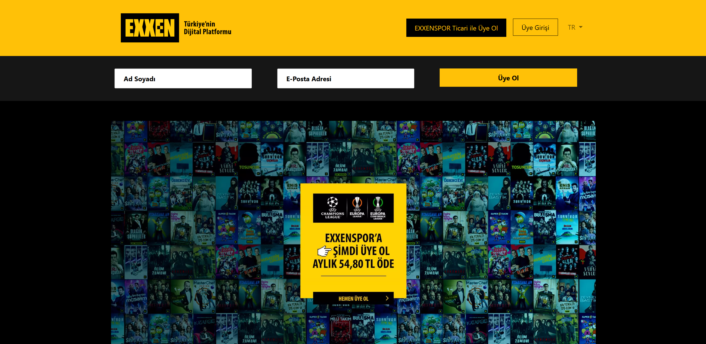

# 🎬 Exxen Home Page  
*Yapım Tarihi: 2022*

Bu proje, Türkiye'nin popüler dijital yayın platformu **Exxen**'in ana sayfasının birebir klonudur.  
Bootstrap 5 ve temel HTML/CSS ile responsive, dinamik olmayan statik bir ön yüz tasarımıdır.

---

## 📝 Proje Hakkında

Bu proje, **Neos Yazılım Akademi** kursu kapsamında, **2022** yılında hazırlanmıştır.  
Amaç, gerçek bir web sitesinin ana sayfasını frontend olarak birebir yeniden oluşturup, Bootstrap ile responsive tasarım pratikleri yapmaktır.

---

## 🚀 Kullanılan Teknolojiler

- HTML5  
- CSS3  
- Bootstrap 5  
- FontAwesome (ikonlar için)

---

## 📸 Ekran Görüntüleri

  
 

---

## 💻 Kullanım

Projeyi çalıştırmak için:

1. Depoyu klonlayın veya ZIP olarak indirin.  
2. `index.html` (veya `exxen.html`) dosyasını tarayıcınızda açın.  
3. `style.css`, `img` klasörü ve diğer dosyaların aynı dizinde olduğundan emin olun.  

---

## ⚠️ Lisans

Bu proje sadece eğitim amaçlıdır. Ticari kullanım için uygun değildir.

---

## 📬 İletişim

Ahmet Mert ÇETİNKAYA  
[GitHub Profili](https://github.com/ahmet-mert-cetinkaya)  
E-posta: ahmet_mert_cetinkaya@outlook.com.tr

---

*Teşekkürler! 🙌*
